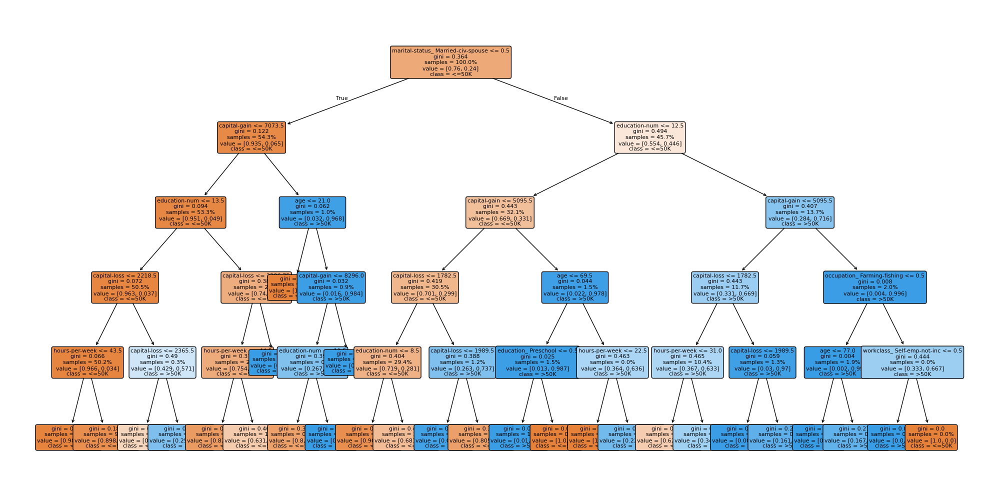
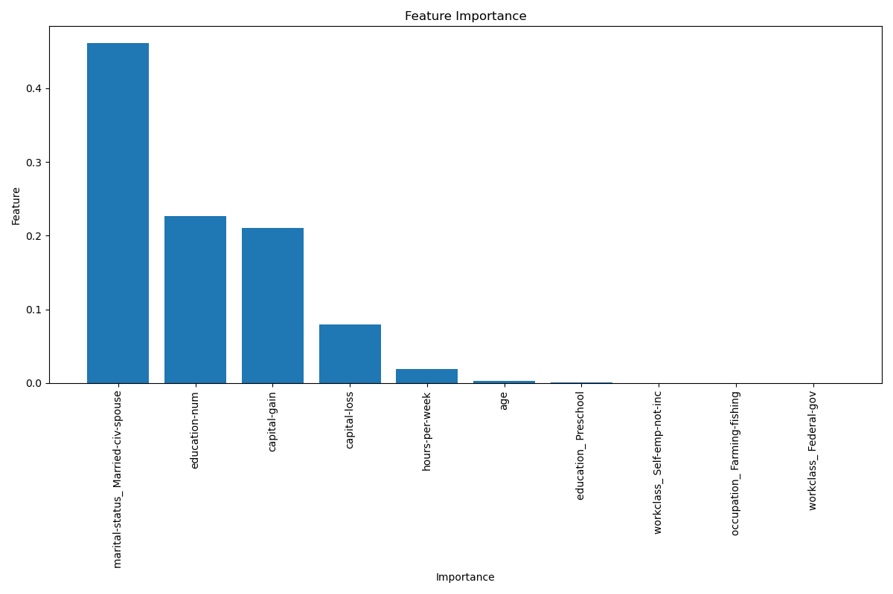
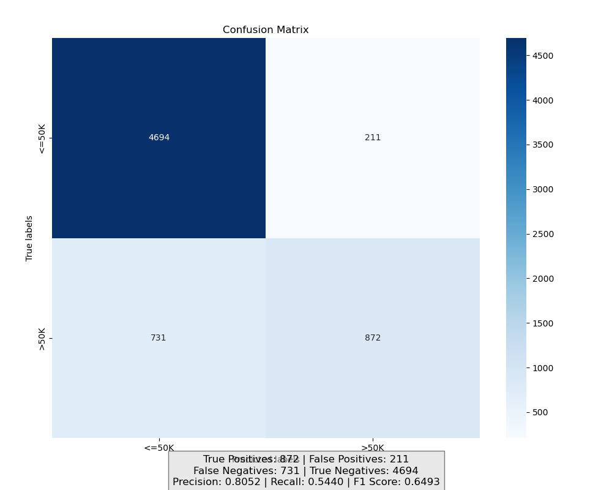

# Salary

## Table of Contents
- [Introduction](#introduction)
- [Dataset](#dataset)
- [Features](#features)
- [Installation](#installation)
- [Usage](#usage)
- [Program Structure](#program-structure)
- [Contributions](#contributions)
- [Screenshots](#screenshots)
- [License](#license)

## Introduction
This project explores explainable machine learning using a decision tree classifier to predict whether an individual's income exceeds $50,000 based on demographic and socioeconomic attributes. The primary goal is to provide transparency in predictions by employing a model that is easy to interpret, and to enhance explainability using various analytical tools.

The classifier is trained and tested on a cleaned version of the `UCI Adult dataset`. The model is then interpreted using intuitive visualisations and rule-based breakdowns to assist in understanding the decision boundaries and feature importance.

This was developed as part of the ICT202 Machine Learning unit at Murdoch University.

## Dataset
This project uses the `UCI Adult Income Dataset`, available [here](https://archive.ics.uci.edu/dataset/2/adult).

## Features
- **Decision Tree Classifier**: Transparent and rule-based model for income prediction.
- **KNN Imputation**: Handles missing categorical data using K-Nearest Neighbors.
- **Outlier Capping**: Reduces the effect of extreme values to ensure robustness.
- **Data Cleaning Pipeline**: Removes duplicates, fills missing values, and encodes categorical features.
- **Model Interpretability**: Visual explanations of the decision tree to aid user understanding.
- **Sample Prediction Explanation**: Demonstrates a real prediction using sample data and walks through the decision path taken by the model, highlighting which features influenced the outcome.

## Installation
### Default Environment
1. Clone the repository:
    ```bash
    git clone https://github.com/mxlodyk/Salary.git
    ```
2. Navigate to the project directory:
    ```bash
    cd Salary
    ```
3. Install the required dependencies:
    ```bash
    pip install -r requirements.txt
    ```
### Conda Environment
1. Recreate the environment:
    ```bash
    conda env create -f environment.yml
    ```
2. Activate the environment:
    ```bash
    conda activate ict202_py310
    ```

### Prerequisites
- Python 3.10.x
- pandas
- NumPy
- scikit-learn
- Matplotlib
- seaborn
- Jupyter Notebook

## Usage
1. Launch Jupyter Notebook:
    ```bash
    jupyter notebook
    ```
2. Open and run the following notebooks:
    - `data_cleaner_ipynb`: Cleans and prepares the dataset.
    - `decision_tree.ipynb`: Trains the decision tree classifier and visualises the results.

## Program Structure
- `data_cleaner.ipynb`: Cleans the raw dataset by handling missing values, encoding categorical data, removing duplicates, converting data types, and capping outliers.
- `topic_model.ipynb`: Conducts additional preprocessing, trains a decision tree classifier, evaluates model accuracy, and visualises the decision path and feature importance.

## Contributions
Contributions are welcome! If you'd like to improve the program or fix any issues, please:
1. Fork the repository.
2. Create a new branch (`git checkout -b feature/your-feature`).
3. Commit your changes (`git commit -m 'Add some feature'`).
4. Push to the branch (`git push origin feature/your-feature`).
5. Open a Pull Request.

## Screenshots




## License
This project is licensed under the MIT License. See the [LICENSE](LICENSE) file for details.